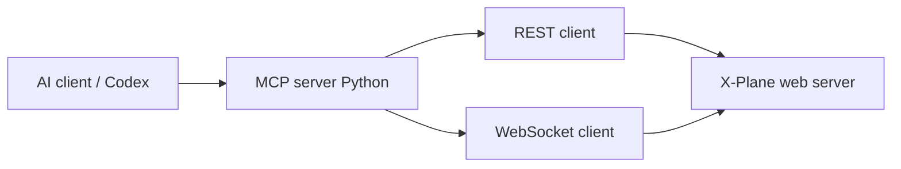

# xplane-ai-mcp

An [MCP (Model Context Protocol)](https://modelcontextprotocol.io/) server that lets local AI assistants (for example OpenAI Codex in the editor) read simulator state from **X-Plane 12** and send commands, using X-Plane’s built-in **local Web API** (REST + WebSocket).

Official API reference: [X-Plane local Web API](https://developer.x-plane.com/article/x-plane-web-api/#The_web_server).

## Goals

- **Read state**: aircraft, flight, and environment-related values via datarefs (and later commands / flight init where the API allows).
- **Act**: set writable datarefs, activate commands, and start or update flights (API v3+) where appropriate.
- **Safe defaults**: assume `localhost` only, respect X-Plane network/security settings, and avoid overlapping command invocations (per API notes).

## Requirements

| Item | Notes |
|------|--------|
| X-Plane | 12.1.1+ for datarefs over HTTP/WebSocket; **12.4.0+** for `POST /flight` and `PATCH /flight` ([flight init API](https://developer.x-plane.com/article/x-plane-web-api/#Start_a_flight_v3)) |
| Python | 3.11+ recommended |
| Network | API is on `http://localhost:8086` by default (WebSocket `ws://localhost:8086/api/v3`). Use `--web_server_port=` if you change the port. “Disable Incoming Traffic” returns **403** for API calls. |

## Architecture (target)



- **REST**: list/find datarefs and commands by name, read values, `PATCH` values, `POST` command activation, `POST`/`PATCH` flight.
- **WebSocket**: subscribe to dataref updates (10 Hz), batch `dataref_set_values`, command subscribe/set for streaming and hold/release patterns.

Dataref and command **IDs are session-local**; resolve names via the list endpoints after each X-Plane start.

## Repository layout (intended)

```
src/xplane_mcp/       # MCP server + X-Plane HTTP/WS client
tests/                # pytest (unit + optional integration markers)
Taskfile.yml          # install, test, lint, run-server, …
pyproject.toml
```

## Development plan

### Phase 0 — Proof of concept (do this first)

1. **Connectivity**: `GET http://localhost:8086/api/capabilities` (unversioned path `/api/capabilities`) to confirm the server is up and which API versions X-Plane reports.
2. **Versioned base URL**: use `http://localhost:8086/api/v3/...` for REST as in the docs.
3. **Start a flight**: `POST /api/v3/flight` with JSON body `{ "data": { ... } }` matching the [Flight Initialization API](https://developer.x-plane.com/article/x-plane-web-api/#Start_a_flight_v3) (aircraft path, ramp start or other supported init).
4. **Read one dataref**: `GET /api/v3/datarefs?filter[name]=<exact_name>&fields=id,name,value_type`, then `GET /api/v3/datarefs/{id}/value` with headers `Accept: application/json` and `Content-Type: application/json` where required.
5. **Manual checklist**: X-Plane running, incoming traffic not disabled, correct port; capture a short log of HTTP status codes and response shapes.

Exit criteria: repeatable script or minimal module that starts a defined flight and prints at least one dataref value without crashing.

### Phase 1 — Client library

- Small HTTP client (timeouts, JSON errors with `error_code` / `error_message`).
- Optional WebSocket client: connect to `ws://localhost:8086/api/v3`, `req_id` tracking, handle `dataref_update_values` and `result` messages.
- Helpers: resolve dataref/command by name with caching for the current session.

### Phase 2 — MCP surface

- Map tools/resources to: capabilities, list/search datarefs, get/set values, list/search commands, activate command, start/update flight (v3).
- Document limits (localhost-only today, ID stability, no overlapping REST command activations).

### Phase 3 — Quality and ops

- pytest: unit tests with mocked HTTP/WS; optional `integration` marker for real X-Plane (skipped in CI by default).
- Configuration: base URL, port, request timeouts, optional flight preset paths for demos.

## Tech stack

| Area | Choice |
|------|--------|
| Language | Python |
| Tests | [pytest](https://pytest.org/) |
| Tasks | [Task](https://taskfile.dev/) (`task install`, `task test`, …) |
| Commits | [Conventional Commits](https://www.conventionalcommits.org/) (see below) |

## Quick start (developers)

```bash
python -m venv .venv
# Windows: .venv\Scripts\activate
# Unix: source .venv/bin/activate
task install
task test
```

## PoC usage

Run the Phase 0 proof of concept with:

```bash
python -m xplane_mcp.poc --skip-flight
```

To attempt a new flight as well, provide a JSON file containing the `data` object for
`POST /api/v3/flight`:

```bash
python -m xplane_mcp.poc --flight-json examples/flight.json
```

To relocate the current aircraft to an airport by ICAO code, reuse the currently
loaded aircraft and provide an airport plus ramp:

```bash
python -m xplane_mcp.poc --airport-icao EDDB --airport-ramp "GATE 01"
```

To start a new flight with both an airport and an explicit aircraft model:

```bash
python -m xplane_mcp.poc --airport-icao EDDB --airport-ramp "GATE 01" --aircraft-path "Aircraft/Laminar Research/Cessna 172SP/Cessna_172SP.acf"
```

To list aircraft from the local X-Plane installation, provide the X-Plane root:

```bash
python -m xplane_mcp.poc --xplane-root "C:\X-Plane 12" --list-planes --skip-flight
```

To change the current aircraft model while staying at the current position:

```bash
python -m xplane_mcp.poc --aircraft-path "Aircraft/Laminar Research/Cessna 172SP/Cessna_172SP.acf"
```

What the PoC does:

- Checks `GET /api/capabilities`
- Connects to `ws://localhost:8086/api/v3`
- Resolves one dataref name to a session-local ID
- Reads the current value over REST
- Waits for one streamed WebSocket update for the same dataref
- Optionally starts a new flight via `POST /api/v3/flight`
- Can start a new flight at an ICAO airport by reading the current aircraft path from X-Plane and issuing a new `POST /flight`
- Can list installed aircraft models from the local X-Plane `Aircraft/` directory
- Can switch the current aircraft model by reading the current lat/lon/heading and starting a new flight in place

Current code separation:

- `src/xplane_mcp/xplane_client.py`: raw HTTP + WebSocket client
- `src/xplane_mcp/mcp_server.py`: MCP-facing service layer that uses the X-Plane client
- `src/xplane_mcp/poc.py`: CLI runner for the README Phase 0 checklist

## Conventional Commits

Use prefixes such as `feat:`, `fix:`, `docs:`, `test:`, `chore:`, `refactor:` with an optional scope, for example:

- `feat(mcp): add dataref read tool`
- `fix(client): handle 403 when incoming traffic disabled`
- `docs: expand PoC checklist in README`

## License

Specify your license here (not set in this repository yet).
