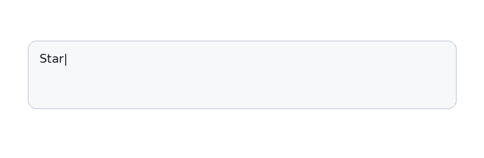
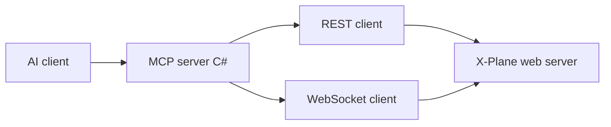

<div align="center">


# X-Plane AI MCP

MCP server for X-Plane 12: drive X-Plane from a local AI assistant with natural language (text or voice) — aircraft, start location, weather, AI traffic, failures, and more.

## Demo

 

</div>

**In short:** this program is an [MCP (Model Context Protocol)](https://modelcontextprotocol.io/) server that connects **X-Plane 12** to a **local AI assistant** (for example Cursor, OpenAI Codex, or Claude Code). The assistant can read simulator state and call X-Plane’s **official local Web API** so you can change weather, position, failures, and more by chatting — including voice if your AI app supports it.

> **Heads-up:** you need **two things** running: **X-Plane 12** with its web API enabled, and an **MCP-capable AI app** that starts this server for you. This repository is **not** a standalone chat or voice app by itself.


[](https://github.com/gvitzi/xplane-ai-mcp/releases/latest/download/xplane_mcp_installer.msi)


---

## Contents

- [Install and Configure](#install-and-connect-players)
- [Example prompts](#example-prompts)
- [Troubleshooting](#troubleshooting)
- [Official X-Plane API documentation](#official-x-plane-api-documentation)
- [MCP tools in this project](#mcp-tools-in-this-project)
- [Developers and contributors](#developers-and-contributors)
- [Disclaimer](#disclaimer)
- [License](#license)

---

## Install and Configure

### 1. What you need

| What | You need | Why |
|------|----------|-----|
| **X-Plane** | **12.1.1+** | Datarefs and commands over HTTP/WebSocket need 12.1.1+. |
| **X-Plane** | **12.4.0+** | Starting or updating a flight via API (`POST` / `PATCH` flight) needs 12.4.0+ (see [flight API](https://developer.x-plane.com/article/x-plane-web-api/#Start_a_flight_v3)). |
| **AI app** | One that supports **MCP over stdio** | Examples: **Cursor**, **OpenAI Codex**, **Claude Code**, or another editor/CLI that can launch this server and expose its tools to the model. |

### 2. Turn on X-Plane’s web server

X-Plane must accept connections from this MCP server on your PC (usually **127.0.0.1** and port **8086**).

1. Open **X-Plane 12**.
2. Enable the **local web server** (REST + WebSocket) in X-Plane’s settings so tools can reach the sim.  
3. Leave the default **host** and **port** unless you changed them; this MCP server uses **`XPLANE_HOST`** (default `127.0.0.1`) and **`XPLANE_PORT`** (default `8086`).

**Authoritative steps and options** are in Laminar’s article: **[X-Plane local Web API](https://developer.x-plane.com/article/x-plane-web-api/)** — use that page if menus or defaults differ in your X-Plane version.

### 3. Download this MCP server

[](https://github.com/gvitzi/xplane-ai-mcp/releases/latest/download/xplane_mcp_installer.msi)


- Run the installer
- Keep the installation path handy (default: `C:\Program Files\xplaneMCP`) - your AI app’s config will need to know where the MCP .exe is.

### 4. Configure your AI app

Your MCP client must **start this server** and use **stdio** (standard input/output) to talk to it — not a browser URL.

**In your AI app’s MCP server settings**

- Point **command** at the correct: by default **command:** `C:\Program Files\xplaneMCP\xplaneMCP.exe`
- Communication must use **standard output** (stdio), as usual for MCP servers.
- Add (Optional) environment variable **`XPLANE_ROOT=C:\SteamLibrary\steamapps\common\X-Plane 12`** (Change path to your X-plane installation folder)

<details>
<summary><strong>Cursor</strong> (JSON)</summary>

Save under **`.cursor/mcp.json`** in your project (or use **Cursor → Settings → Tools & MCP**), merging with any servers you already have.

**Published executable:**

```json
{
  "mcpServers": {
    "xplane-ai-mcp": {
      "command": "E:\\path\\to\\xplane-ai-mcp\\artifacts\\xplane-mcp\\xplaneMCP.exe",
      "args": [],
      "cwd": "E:\\path\\to\\xplane-ai-mcp",
      "env": {}
    }
  }
}
```

Use forward slashes in `cwd` on macOS/Linux.

</details>

<details>
<summary><strong>Codex</strong> (TOML)</summary>

Edit **`%USERPROFILE%\.codex\config.toml`**. Each `[mcp_servers.*]` name must be unique.

**Published executable:**

```toml
[mcp_servers.xplaneMCP]
command = 'E:/path/to/xplane-ai-mcp/artifacts/xplane-mcp/xplaneMCP.exe'
args = []
enabled = true
```

</details>

<details>
<summary><strong>Claude Desktop</strong> and others</summary>

Community examples for **Claude Desktop** MCP config are welcome — open a PR or issue with a tested snippet.

Any client that supports **stdio** MCP and can spawn an executable should work if **command**, **args**, and **cwd** are set correctly.

</details>

### 5. Confirm it works

With X-Plane running and the web API enabled, ask your assistant something simple, for example: *“What is my current latitude and longitude in the sim?”* If the MCP server and X-Plane are reachable, the model should return values from the simulator.

---

## Example prompts

Plain-language ideas you can paste into your assistant; it should translate them into the right MCP tools and X-Plane API calls. Each prompt is in its own block so you can copy one at a time.

```
Start a new flight in a Cessna 172 on the ground in a small airfield in France.
```

```
Put me in a 737 on the ground at EGLL, at night, with low IFR weather.
```

```
Let me train gusty crosswind landings in a Baron B58 on a 3 mile final to EDDB.
```

```
Start on runway 07 at EDAZ, in a C172, and make the engine fail at 600 ft AGL.
```

```
Put me in the air at 5000 ft near an exotic island, with few clouds and calm winds.
```

---

## Troubleshooting

| Problem | What to try |
|---------|-------------|
| Assistant says it cannot reach X-Plane | Confirm X-Plane is running, the **web server** is enabled, and host/port match **`XPLANE_HOST`** / **`XPLANE_PORT`**. See [X-Plane local Web API](https://developer.x-plane.com/article/x-plane-web-api/). |
| Firewall prompts | Allow **localhost** traffic for X-Plane and this MCP process if your OS asks. |
| Wrong or empty aircraft lists | Set **`XPLANE_ROOT`** to your real X-Plane install folder **in your AI agent’s MCP configuration** (the same place you set `command` and `cwd`—for example Cursor’s **`env`** block in **`.cursor/mcp.json`**). Restart or reload the MCP server after saving so the new variable is applied. |
| Flight start fails | You may need **X-Plane 12.4.0+** for `POST /api/v3/flight`. Check the [flight section](https://developer.x-plane.com/article/x-plane-web-api/#Start_a_flight_v3) of the Web API article. |
| MCP server never starts | Check **command** path, **cwd**, and that **stdio** is selected (not HTTP) in the client. |

---

## Official X-Plane API documentation

This MCP server is a **client** of X-Plane’s documented interfaces. For correct URLs, payloads, and behavior, rely on Laminar’s developer docs:

| Topic | Link |
|-------|------|
| **Web API overview** (enable server, REST, WebSocket) | [X-Plane local Web API](https://developer.x-plane.com/article/x-plane-web-api/) |
| **Start / update flight** (`POST` / `PATCH` flight, v3) | [Flight Initialization API](https://developer.x-plane.com/article/flight-initialization-api/) and [Web API — Start a flight](https://developer.x-plane.com/article/x-plane-web-api/#Start_a_flight_v3) |
| **Datarefs and commands** | Described in the Web API article (listing, reading, writing, subscribing) |

If a tool in this repo disagrees with the official documentation, **trust X-Plane’s documentation** and please open an issue here.

---

## MCP tools in this project

A concise table of tool names and roles lives in **[`MCP_API_OVERVIEW.md`](MCP_API_OVERVIEW.md)**. Full parameter schemas come from the running MCP server.

---

## Developers and contributors

See **[CONTRIBUTING.md](CONTRIBUTING.md)** for build commands, tests, and pull request guidelines. To report security issues privately, see **[SECURITY.md](SECURITY.md)**.

### Advanced Configuration

**Optional environment variables** (this MCP server):

| Variable | Default | Purpose |
|----------|---------|---------|
| `XPLANE_HOST` | `127.0.0.1` | Web API host |
| `XPLANE_PORT` | `8086` | Web API port |
| `XPLANE_TIMEOUT` | `5` | HTTP timeout (seconds) |
| `XPLANE_ROOT` | *(unset)* | X-Plane install root; configure via **your MCP client** (e.g. Cursor `env` in `mcp.json`). Used for `list_available_planes`, liveries, and aircraft paths |

### Build and packaging

**Release publish and MSI (PowerShell, repo root):**

```powershell
.\scripts\publish-server.ps1 -Configuration Release
.\scripts\build-msi.ps1 -Configuration Release
```

Published output defaults to **`artifacts/xplane-mcp`**.

### Architecture



- **REST:** list/find datarefs and commands, read and patch values, activate commands, start/update flight.
- **WebSocket:** subscribe to dataref updates (e.g. for `get_state` with `use_websocket`).

Dataref and command **IDs are session-local**; resolve names via the list endpoints after each X-Plane start.


### Tech stack

| Area | Choice |
|------|--------|
| MCP server | C# / **net9.0**, [ModelContextProtocol](https://www.nuget.org/packages/ModelContextProtocol) |
| Integration tests | Python 3.11+ pytest spawns [`XPlaneMcp.Server`](src/XPlaneMcp.Server/) (see `tests/mcp_stdio.py`) |
| Tests | **xUnit** (.NET), **pytest** (integration + smoke) |
| Commits | [Conventional Commits](https://www.conventionalcommits.org/) (see below) |

### Integration tests (repo root)

Default `pytest` excludes `integration`-marked tests (`addopts` in [`pyproject.toml`](pyproject.toml)). Live tests change the running X-Plane session; run only when X-Plane is up with the Web API enabled.

```bash
pytest -m integration --xplane-root="E:\SteamLibrary\steamapps\common\X-Plane 12"
# optional helper: .\make.ps1 test-integration -- --xplane-root="E:\path\to\X-Plane 12"
```

Build the MCP server first (`dotnet build -c Release` or `.\make.ps1 install` if you use the repo script) so `tests/conftest.py` can find `xplaneMCP.exe` under `src/XPlaneMcp.Server/bin/...`, or pass **`--mcp-server=PATH`**.

Pytest options are registered from [`tests/conftest.py`](tests/conftest.py):

- `--xplane-root` (required for integration): path to your X-Plane installation (sets `XPLANE_ROOT` for the server process)
- `--mcp-server` (optional): path to `xplaneMCP.exe` (or native binary) if auto-detection fails
- `--xplane-host`, `--xplane-port`, `--xplane-timeout`: Web API connection tuning
- `--xplane-test-airport`, `--xplane-test-ramp`: start-flight test (defaults: KPDX, A1)
- `--xplane-weather-region-index`: array index for `sim/weather/region/*` in the sea-level pressure test, or `-1` (default) to auto-detect scalar vs index `0`
- `--xplane-keep-cloud-layer`: for regional cloud integration tests, skip restoring written cloud datarefs so you can inspect the sim (see test docstrings for weather UI and timing)

**Cloud / clear-sky test visuals:** those tests normally **revert** regional cloud datarefs when they finish. Use `--xplane-keep-cloud-layer`, switch X-Plane weather to **manual / custom** (not live METAR), turn on **volumetric clouds** (for clouds), and allow **up to a few minutes** for the sim to refresh drawn clouds.

### Conventional Commits

Use prefixes such as `feat:`, `fix:`, `docs:`, `test:`, `chore:`, `refactor:` with an optional scope, for example:

- `feat(mcp): add dataref read tool`
- `fix(client): handle 403 when incoming traffic disabled`
- `docs: clarify README install steps`

Pull requests and small, focused changes are welcome. For larger features, open an issue first so we can align on scope.

---

## Disclaimer

**Use at your own risk.** This software can change simulator state (flight, weather, failures, etc.). The authors are **not responsible** for any damage, loss, or inappropriate use. This project is **not affiliated with or endorsed by Laminar Research**.

Portions of this repository were developed with assistance from **AI coding tools**.

---

## License

This project is licensed under the [MIT License](LICENSE).
