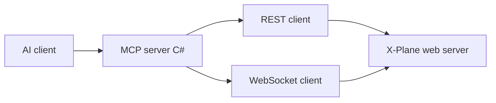

# xplane-ai-mcp

An [MCP (Model Context Protocol)](https://modelcontextprotocol.io/) server that lets local AI assistants (for example OpenAI Codex in the editor) read simulator state from **X-Plane 12** and send commands, using X-Plane’s built-in **local Web API** (REST + WebSocket).

The **supported MCP server** is implemented in **C#** ([ModelContextProtocol](https://www.nuget.org/packages/ModelContextProtocol) SDK, **stdio** transport). A small **Python** [`XPlaneHttpClient`](python/src/xplane_mcp/xplane_client.py) is kept under [`python/src/xplane_mcp/`](python/src/xplane_mcp/) for **live integration tests** (pytest against a running simulator) in the repo-root [`tests/`](tests/) folder; pytest adds that path via [`pyproject.toml`](pyproject.toml).

## Quick usage guide

### Prerequisites

- **X-Plane 12** running with the **local Web API** enabled (default `http://127.0.0.1:8086`). The session must allow incoming API traffic (see [Requirements](#requirements)).
- **[.NET SDK](https://dotnet.microsoft.com/download)** **9.0+** (solution targets `net9.0`) to build and run the MCP server.
- **Python 3.11+** only if you run **repo-root pytest** (integration tests or the import smoke test).

### Install (repo root)

```bash
task install
# or: make install   /   .\make.ps1 install
```

This restores and builds [`src/XPlaneMcp.sln`](src/XPlaneMcp.sln) and `pip install -e ".[dev]"` for pytest dependencies. Use `task install-dotnet` or `task install-py-dev` to do only one side.

### Build and deploy (publish folder)

Publish a **Release** build to [`artifacts/xplane-mcp/`](artifacts/xplane-mcp/) (gitignored):

```bash
task publish
# or: make publish   /   .\make.ps1 publish
# Unix: task publish-sh   /   make publish-sh   /   bash scripts/publish-server.sh
```

Point your MCP client at `artifacts/xplane-mcp/XPlaneMcp.Server.exe` (Windows) or run with `dotnet /path/to/XPlaneMcp.Server.dll`.

### Local MCP configuration (Cursor)

Register a **stdio** MCP server. For [Cursor](https://docs.cursor.com/context/mcp), use project `.cursor/mcp.json` or **Settings → Tools & MCP**.

**Published executable (recommended after `task publish`):**

```json
{
  "mcpServers": {
    "xplane-ai-mcp": {
      "command": "E:\\path\\to\\xplane-ai-mcp\\artifacts\\xplane-mcp\\XPlaneMcp.Server.exe",
      "args": [],
      "cwd": "E:\\path\\to\\xplane-ai-mcp",
      "env": {}
    }
  }
}
```

**Development (`dotnet run`):**

```json
{
  "mcpServers": {
    "xplane-ai-mcp": {
      "command": "dotnet",
      "args": ["run", "--project", "src/XPlaneMcp.Server/XPlaneMcp.Server.csproj", "-c", "Release"],
      "cwd": "E:\\path\\to\\xplane-ai-mcp",
      "env": {}
    }
  }
}
```

Use forward slashes in `cwd` on macOS/Linux. Optional **environment variables** (read by the server):

| Variable | Default | Purpose |
|----------|---------|---------|
| `XPLANE_HOST` | `127.0.0.1` | Web API host |
| `XPLANE_PORT` | `8086` | Web API port |
| `XPLANE_TIMEOUT` | `5` | HTTP timeout (seconds) |
| `XPLANE_ROOT` | *(unset)* | X-Plane install root; required for `list_available_planes` / aircraft paths |

### Example prompts

These assume the assistant can call your X-Plane MCP tools (wording can be adapted):

- “What are my current latitude, longitude, and indicated airspeed from the simulator?”
- “Start a new flight at **KPDX** ramp **A1** with the current aircraft (or tell me if the API needs an explicit aircraft path).”
- “Resolve the dataref for outside air temperature, read its value, and report it with units.”
- “For a training scenario, trigger a **complete failure on engine 1** via the failure datarefs, then summarize how I would clear it in X-Plane.”

---

Official X-Plane API reference: [X-Plane local Web API](https://developer.x-plane.com/article/x-plane-web-api/#The_web_server).

## Goals

- **Read state**: aircraft, flight, and environment-related values via datarefs (and commands / flight init where the API allows).
- **Act**: set writable datarefs, activate commands, and start or update flights (API v3+) where appropriate.
- **Safe defaults**: assume `localhost` only, respect X-Plane network/security settings, and avoid overlapping command activations (per API notes).

## Requirements

| Item | Notes |
|------|--------|
| X-Plane | 12.1.1+ for datarefs over HTTP/WebSocket; **12.4.0+** for `POST /flight` and `PATCH /flight` ([flight init API](https://developer.x-plane.com/article/x-plane-web-api/#Start_a_flight_v3)) |
| .NET | SDK **9.0+** for the MCP server |
| Python | 3.11+ optional (integration pytest + `python/src/xplane_mcp` client) |
| Network | API is on `http://localhost:8086` by default (WebSocket `ws://localhost:8086/api/v3`). Use `--web_server_port=` if you change the port. “Disable Incoming Traffic” returns **403** for API calls. |

## Architecture



- **REST**: list/find datarefs and commands by name, read values, `PATCH` values, `POST` command activation, `POST`/`PATCH` flight.
- **WebSocket**: subscribe to dataref updates (e.g. for `get_state` with `use_websocket`).

Dataref and command **IDs are session-local**; resolve names via the list endpoints after each X-Plane start.

## Repository layout

```text
src/XPlaneMcp.sln          # .NET solution
src/XPlaneMcp.Server/      # MCP stdio server + X-Plane clients + tools
python/src/xplane_mcp/     # Python Web API client (editable install + pytest PYTHONPATH)
tests/                     # pytest integration tests + conftest (`pythonpath` → python/src)
scripts/publish-server.*   # publish to artifacts/xplane-mcp
pyproject.toml             # pip install -e ".[dev]", pytest config
Taskfile.yml / Makefile    # .NET + integration pytest
```

Optional local **`refs/`** (not in git): CSV and index snapshots from X-Plane’s `DataRefs.txt` are gitignored. Generate them with `python scripts/datarefs_txt_to_csv.py --help`.

## Development plan (status)

- **Phase 0 — PoC**: superseded for **connectivity** by the C# server.
- **Phase 1 — Client library**: implemented in C# (`XPlaneRestClient`, `XPlaneWebSocketSession`); Python [`XPlaneHttpClient`](python/src/xplane_mcp/xplane_client.py) remains for pytest only.
- **Phase 2 — MCP surface**: **stdio MCP tools** implemented in [`XPlaneMcpTools`](src/XPlaneMcp.Server/XPlaneMcpTools.cs) (capabilities, flight, datarefs, commands, failures, `get_state`, etc.).
- **Phase 3 — Quality**: `dotnet test` + pytest; integration tests marked `integration`.

## Tech stack

| Area | Choice |
|------|--------|
| MCP server | C# / **net9.0**, [ModelContextProtocol](https://www.nuget.org/packages/ModelContextProtocol) |
| Integration client | Python 3.11+; [`python/src/xplane_mcp`](python/src/xplane_mcp/) (pytest `PYTHONPATH`) |
| Tests | **xUnit** (.NET), **pytest** (integration + smoke) |
| Tasks | [Task](https://taskfile.dev/) (`task …`), **Make** / **make.ps1** at repo root |
| Commits | [Conventional Commits](https://www.conventionalcommits.org/) (see below) |

## Integration tests (repo root)

The default `pytest` run excludes `integration`-marked tests (`addopts` in [`pyproject.toml`](pyproject.toml)). Live simulator tests change the running X-Plane session; run them only when X-Plane is up with the Web API enabled.

```bash
pytest -m integration --xplane-root="E:\SteamLibrary\steamapps\common\X-Plane 12"
# or: task test-integration -- --xplane-root="..."
```

Pytest CLI options are registered from [`tests/conftest.py`](tests/conftest.py):

- `--xplane-root` (required for integration): path to your X-Plane installation
- `--xplane-host`, `--xplane-port`, `--xplane-timeout`: Web API connection tuning
- `--xplane-test-airport`, `--xplane-test-ramp`: start-flight test (defaults: KPDX, A1)
- `--xplane-weather-region-index`: array index for `sim/weather/region/*` in the sea-level pressure test, or `-1` (default) to auto-detect scalar vs index `0`
- `--xplane-keep-cloud-layer`: for regional cloud integration tests (low broken layer, clear sky), skip restoring written cloud datarefs so you can inspect the sim (see test docstrings for weather UI and timing)

**Cloud / clear-sky test visuals:** those tests normally **revert** regional cloud datarefs when they finish. Use `--xplane-keep-cloud-layer`, switch X-Plane weather to **manual / custom** (not live METAR), turn on **volumetric clouds** (for clouds), and wait up to about **60 seconds** for the sim to refresh drawn clouds.

## Conventional Commits

Use prefixes such as `feat:`, `fix:`, `docs:`, `test:`, `chore:`, `refactor:` with an optional scope, for example:

- `feat(mcp): add dataref read tool`
- `fix(client): handle 403 when incoming traffic disabled`
- `docs: expand PoC checklist in README`

## License

Specify your license here (not set in this repository yet).
