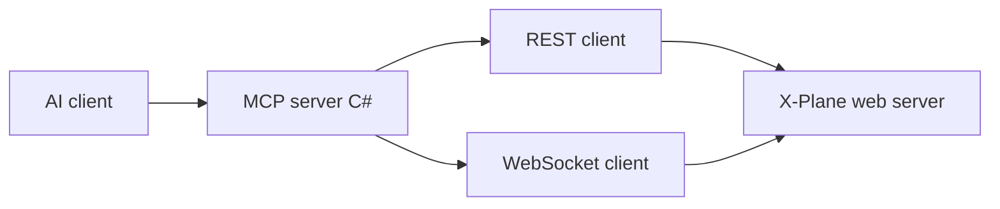

# xplane-ai-mcp

An [MCP (Model Context Protocol)](https://modelcontextprotocol.io/) server that lets local AI assistants (for example OpenAI Codex in the editor) read simulator state from **X-Plane 12** and send commands, using X-Plane’s built-in **local Web API** (REST + WebSocket).

## User Guide

### Requirements

| Item | Requirements | Notes | 
|------|--------------|-------|
| AI Agent | **OpenAI Codex**, **Claude Code**, **Cursor**, or another editor or CLI that speaks MCP | A **local** MCP-capable client must run this server over **stdio** and expose its tools to the model. The executable alone is not a standalone chat UI. |
| X-Plane | 12.1.1+ | **12.1.1+** for datarefs over HTTP/WebSocket; **12.4.0+** for `POST /flight` and `PATCH /flight` ([flight init API](https://developer.x-plane.com/article/x-plane-web-api/#Start_a_flight_v3)) |

### Quick Start

#### 1. Download and install the xplaneMCP
TBD - link to executable

#### 2. Confiugure your AI Agent

Point your MCP client at `artifacts/xplane-mcp/XPlaneMcp.Server.exe` (Windows) or run with `dotnet /path/to/XPlaneMcp.Server.dll`. see following configuration examples below:

<details>
<summary><strong>Cursor</strong> (JSON)</summary>

**Published executable:** save the JSON below as **`.cursor/mcp.json`** in this repo root (create the `.cursor` folder if needed), merging the `mcpServers` block with any servers you already use—or add the same server via **Cursor → Settings → Tools & MCP** (UI edits the same config at project or user scope).

```json
{
  "mcpServers": {
    "xplane-ai-mcp": {
      "command": "E:\\path\\to\\xplane-ai-mcp\\artifacts\\xplane-mcp\\XPlaneMcp.Server.exe",
      "args": [],
      "cwd": "E:\\path\\to\\xplane-ai-mcp",
      "env": {}
    }
  }
}
```

**Development (`dotnet run`):**

```json
{
  "mcpServers": {
    "xplane-ai-mcp": {
      "command": "dotnet",
      "args": ["run", "--project", "src/XPlaneMcp.Server/XPlaneMcp.Server.csproj", "-c", "Release"],
      "cwd": "E:\\path\\to\\xplane-ai-mcp",
      "env": {}
    }
  }
}
```

Use forward slashes in `cwd` on macOS/Linux.

</details>

<details>
<summary><strong>Codex</strong> (TOML)</summary>

**Where to put it:** edit Codex’s user config file—**`%USERPROFILE%\.codex\config.toml`** on Windows or **`~/.codex/config.toml`** on macOS/Linux. Create the `.codex` folder or `config.toml` if it does not exist yet (Codex normally creates them on first setup). Paste the table below into that file, or merge it with other **`[mcp_servers.*]`** blocks you already have; each server must use a **unique** table name (here `xplaneMCP`).

**Published executable:**

```toml
[mcp_servers.xplaneMCP]
command = 'E:/path/to/xplane-ai-mcp/artifacts/xplane-mcp/XPlaneMcp.Server.exe'
args = []
enabled = true
```

**Development (`dotnet run` from repo root):** use the same `[mcp_servers.xplaneMCP]` key or pick another name; point `command` at `dotnet` and pass the project via `args` (adjust the drive/path to your clone).

```toml
[mcp_servers.xplaneMCP]
command = 'dotnet'
args = [
  'run',
  '--project',
  'E:/path/to/xplane-ai-mcp/src/XPlaneMcp.Server/XPlaneMcp.Server.csproj',
  '-c',
  'Release',
]
enabled = true
```

</details>

<details>
<summary><strong>Claude Desktop</strong></summary>

Contribution needed here

</details>

When configuring through UI:
* make sure the MCP configuration points to the correct installation directory and executable of the mcpServer
* communincation protocl should use stdout (or Standard Output)
* optionally add the XPLANE_ROOT="<your xplane installation directory>" as an environment varaible. this is only needed to ask AI Agent to change model to a 3rd-party aircraft.

Optional **environment variables** (read by the server):

| Variable | Default | Purpose |
|----------|---------|---------|
| `XPLANE_HOST` | `127.0.0.1` | Web API host |
| `XPLANE_PORT` | `8086` | Web API port |
| `XPLANE_TIMEOUT` | `5` | HTTP timeout (seconds) |
| `XPLANE_ROOT` | *(unset)* | X-Plane install root; required for `list_available_planes` / aircraft paths |

### Example prompts

These assume the assistant can call your X-Plane MCP tools (wording can be adapted):

- “What are my current latitude, longitude, and indicated airspeed from the simulator?”
- “Start a new flight at **KPDX** ramp **A1** with the current aircraft (or tell me if the API needs an explicit aircraft path).”
- “Resolve the dataref for outside air temperature, read its value, and report it with units.”
- “For a training scenario, trigger a **complete failure on engine 1** via the failure datarefs, then summarize how I would clear it in X-Plane.”

---

Official X-Plane API reference: [X-Plane local Web API](https://developer.x-plane.com/article/x-plane-web-api/#The_web_server).

# Developers

## Build
**Release publish and MSI (PowerShell, repo root):** run both scripts to refresh the publish folder and the installer:

```powershell
.\scripts\publish-server.ps1 -Configuration Release
.\scripts\build-msi.ps1 -Configuration Release
```

## Architecture



- **REST**: list/find datarefs and commands by name, read values, `PATCH` values, `POST` command activation, `POST`/`PATCH` flight.
- **WebSocket**: subscribe to dataref updates (e.g. for `get_state` with `use_websocket`).

Dataref and command **IDs are session-local**; resolve names via the list endpoints after each X-Plane start.

## Repository layout

```text
src/XPlaneMcp.sln          # .NET solution
src/XPlaneMcp.Server/      # MCP stdio server + X-Plane clients + tools
tests/                     # pytest: MCP stdio harness (`mcp_stdio.py`) + integration tests
scripts/publish-server.*   # publish to artifacts/xplane-mcp
scripts/build-msi.*        # WiX: artifacts/installer/xplaneMCP.msi
installer/                 # xplaneMcp.wixproj + Package.wxs
Directory.Build.props      # shared Version for app + MSI ProductVersion
pyproject.toml             # pip install -e ".[dev]", pytest config
Makefile / make.ps1        # .NET + integration pytest + msi (optional convenience)
```

Optional local **`.refs/`** (not in git): CSV and index snapshots from X-Plane’s `DataRefs.txt` are gitignored. Generate them with `python scripts/datarefs_txt_to_csv.py --help`.

## Development plan (status)

- **Phase 0 — PoC**: superseded for **connectivity** by the C# server.
- **Phase 1 — Client library**: implemented in C# (`XPlaneRestClient`, `XPlaneWebSocketSession`).
- **Phase 2 — MCP surface**: **stdio MCP tools** implemented in [`XPlaneMcpTools`](src/XPlaneMcp.Server/XPlaneMcpTools.cs) (capabilities, flight, datarefs, commands, failures, `get_state`, etc.).
- **Phase 3 — Quality**: `dotnet test` + pytest; integration tests marked `integration`.

## Tech stack

| Area | Choice |
|------|--------|
| MCP server | C# / **net9.0**, [ModelContextProtocol](https://www.nuget.org/packages/ModelContextProtocol) |
| Integration tests | Python 3.11+ pytest spawns [`XPlaneMcp.Server`](src/XPlaneMcp.Server/) (see `tests/mcp_stdio.py`) |
| Tests | **xUnit** (.NET), **pytest** (integration + smoke) |
| Automation | **GNU Make** ([`Makefile`](Makefile)) or **[`make.ps1`](make.ps1)** at repo root |
| Commits | [Conventional Commits](https://www.conventionalcommits.org/) (see below) |

## Integration tests (repo root)

The default `pytest` run excludes `integration`-marked tests (`addopts` in [`pyproject.toml`](pyproject.toml)). Live simulator tests change the running X-Plane session; run them only when X-Plane is up with the Web API enabled.

```bash
pytest -m integration --xplane-root="E:\SteamLibrary\steamapps\common\X-Plane 12"
# or: make test-integration PYTEST_ARGS='--xplane-root="E:\path\to\X-Plane 12"'
```

Build the MCP server first (`dotnet build -c Release` or `make install` / `.\make.ps1 install`) so `tests/conftest.py` can find `XPlaneMcp.Server.exe` under `src/XPlaneMcp.Server/bin/...`, or pass **`--mcp-server=PATH`** to the executable.

Pytest CLI options are registered from [`tests/conftest.py`](tests/conftest.py):

- `--xplane-root` (required for integration): path to your X-Plane installation (sets `XPLANE_ROOT` for the server process)
- `--mcp-server` (optional): path to `XPlaneMcp.Server.exe` (or native binary) if auto-detection fails
- `--xplane-host`, `--xplane-port`, `--xplane-timeout`: Web API connection tuning
- `--xplane-test-airport`, `--xplane-test-ramp`: start-flight test (defaults: KPDX, A1)
- `--xplane-weather-region-index`: array index for `sim/weather/region/*` in the sea-level pressure test, or `-1` (default) to auto-detect scalar vs index `0`
- `--xplane-keep-cloud-layer`: for regional cloud integration tests (low broken layer, clear sky), skip restoring written cloud datarefs so you can inspect the sim (see test docstrings for weather UI and timing)

**Cloud / clear-sky test visuals:** those tests normally **revert** regional cloud datarefs when they finish. Use `--xplane-keep-cloud-layer`, switch X-Plane weather to **manual / custom** (not live METAR), turn on **volumetric clouds** (for clouds), and wait up to about **60 seconds** for the sim to refresh drawn clouds.

## Conventional Commits

Use prefixes such as `feat:`, `fix:`, `docs:`, `test:`, `chore:`, `refactor:` with an optional scope, for example:

- `feat(mcp): add dataref read tool`
- `fix(client): handle 403 when incoming traffic disabled`
- `docs: added more prompt examples in README`

## License

Specify your license here (not set in this repository yet).
